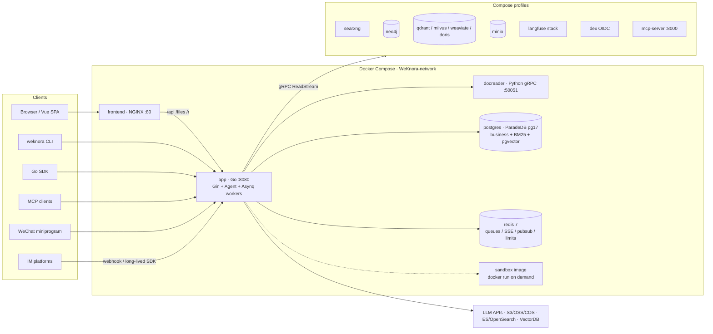
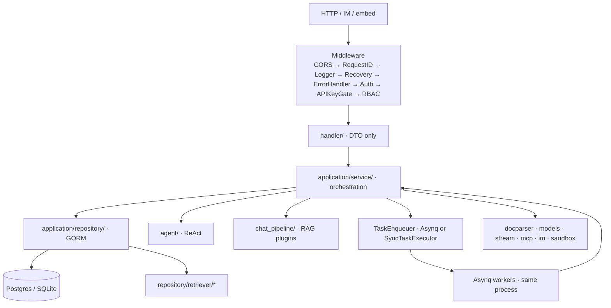
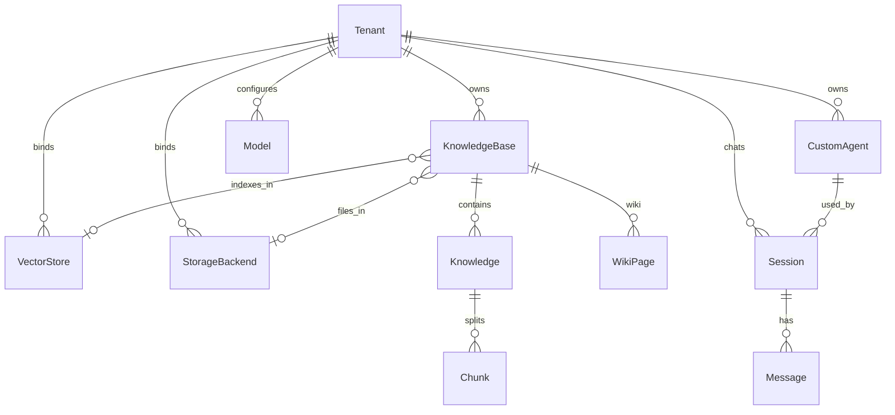
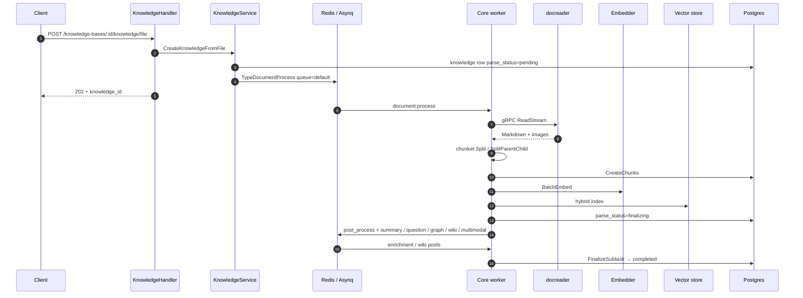
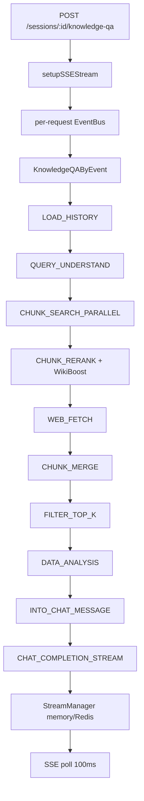
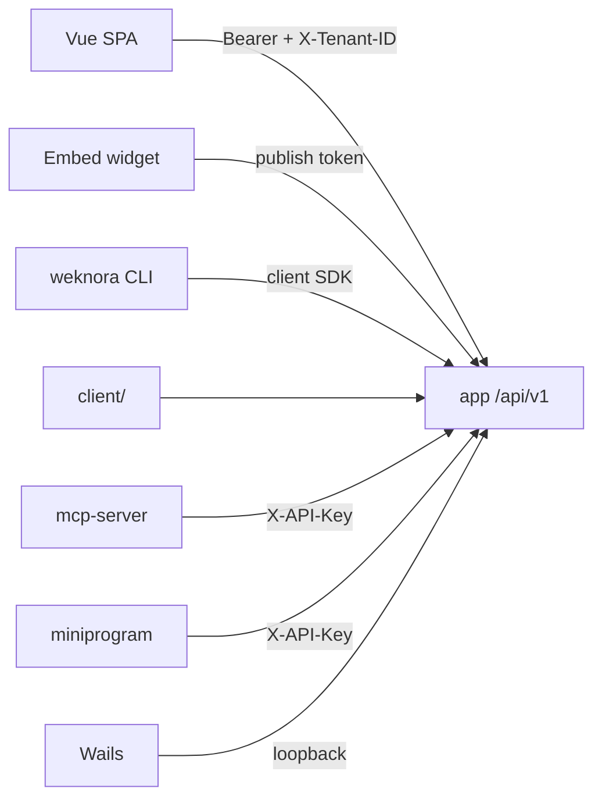

# WeKnora Architecture

This document describes the **current** WeKnora architecture as implemented in this repository (Go 1.26, Vue 3, Python docreader). It is the map of processes, layers, and request paths — not a product brochure.

Companion pages (Chinese, more detail on single slices):

- [System overview](../website-docs/02-architecture/01-overview.md)
- [Go backend design](../website-docs/02-architecture/02-backend-design.md)
- [Document pipeline](../website-docs/02-architecture/03-document-pipeline.md)
- [RAG pipeline](../website-docs/02-architecture/04-rag-pipeline.md)
- [Async tasks](../website-docs/02-architecture/05-async-tasks.md)

---

## 1. What the system is

WeKnora is a self-hostable knowledge platform. One Go process (`app`) owns HTTP, RAG, the ReAct agent, IM/embed channels, and Asynq workers. A Python gRPC service (`docreader`) parses documents. A Vue SPA (`frontend`) is the primary UI.

Three product surfaces share the same backend:

| Surface | What it does | How it runs |
|---------|--------------|-------------|
| **Quick Q&A** | RAG over knowledge bases | Event-driven chat pipeline, SSE |
| **Smart Reasoning** | ReAct agent with tools, MCP, skills, web search | `internal/agent` loop, SSE |
| **Wiki Mode** | Agents distill documents into linked Markdown pages + a page graph | Asynq `wiki:*` tasks + wiki tools |

A **workspace** is a `Tenant`. Knowledge lives in **knowledge bases** of type `document`, `faq`, or `wiki`. Retrieval, storage, models, and sandbox backends are pluggable per workspace (and often per KB).

---

## 2. Process topology

Default Docker Compose (`docker-compose.yml`) starts five things. Everything else is a Compose **profile**.



| Service | Image / build | Port | Role |
|---------|---------------|------|------|
| `frontend` | `frontend/` (NGINX + Vue dist) | `:80` | SPA + reverse proxy to `app` |
| `app` | `docker/Dockerfile.app` | `:8080` | All business logic. Health: `GET /health` |
| `docreader` | `docker/Dockerfile.docreader` | `:50051` (internal) | Parse 25+ formats to Markdown + images |
| `postgres` | `paradedb/paradedb:v0.22.2-pg17` | `:5432` | Default store; BM25 + pgvector so no extra vector DB is required |
| `redis` | `redis:7.0-alpine` | `:6379` | Asynq broker, SSE resume, settings pub/sub, rate limits, per-model concurrency |

Shared volumes: `data-files` → `/data/files` on `app`; `docreader-tmp` → `/tmp/docreader` (docreader writes, app reads).

### Optional profiles

| Profile | Services | Why |
|---------|----------|-----|
| `searxng` / `full` | searxng | Self-hosted web search |
| `neo4j` / `full` | neo4j | GraphRAG entity store (`NEO4J_ENABLE`) |
| `minio` / `full` | minio | Object storage (`STORAGE_TYPE=minio`) |
| `qdrant` / `milvus` / `weaviate` / `doris` | matching engines | Swap `RETRIEVE_DRIVER` |
| `odl-hybrid` | OpenDataLoader PDF sidecar `:5002` | Heavier PDF parse |
| `dex` / `full` | Dex IdP | OIDC test |
| `langfuse` / `full` | Langfuse web/worker/ClickHouse | Self-hosted traces |
| `full` | sandbox + searxng + minio + neo4j + qdrant + dex + langfuse + mcp | Kitchen sink |

`app` can also talk to engines that are **not** in Compose: Elasticsearch v7/v8, OpenSearch, Tencent VectorDB, VikingDB, and eight object-storage backends (local / MinIO / COS / TOS / S3 / OSS / KS3 / OBS).

### Other deployment shapes

| Shape | How | Difference |
|-------|-----|------------|
| **Standard** | Compose / Helm | Postgres + Redis + docreader + workers in-process |
| **Lite** | `DB_DRIVER=sqlite` + no `REDIS_ADDR` | In-process `SyncTaskExecutor`, sqlite-vec, frontend embedded when `handler.Edition == "lite"` |
| **Desktop** | `cmd/desktop` (Wails v2) | Same Gin backend in a goroutine + WebView |
| **Kubernetes** | `helm/` | frontend / app / docreader / postgres / redis + optional extras |
| **Bare metal** | `deploy/weknora-lite.service` | systemd Lite unit |
| **macOS** | `Formula/weknora-lite.rb` | Homebrew Lite binary |
| **Dev** | `docker-compose.dev.yml` | Infra only (postgres/redis/docreader published). Run `go run ./cmd/server` + `npm run dev` locally |

---

## 3. Repository map

Go module: `github.com/Tencent/WeKnora`.

| Path | What lives there |
|------|------------------|
| `cmd/server` | HTTP process: `main.go`, bootstrap, listen-with-retry, Unix/Windows signals |
| `cmd/desktop` | Wails desktop shell |
| `cmd/download/duckdb` | One-shot DuckDB extension installer for `data_analysis` |
| `internal/` | Entire Go backend (see §4) |
| `frontend/` | Vue 3 + Vite 7 + TDesign + Pinia. Dual entry: `index.html` (SPA) and `embed.html` (iframe widget) |
| `docreader/` | Python gRPC parser (`main.py`, `parser/`, `proto/docreader.proto`) |
| `cli/` | `weknora` CLI (~30 commands) + curated read-only `weknora mcp serve` |
| `client/` | Go HTTP SDK used by the CLI |
| `mcp-server/` | Python MCP server (~29 write-capable tools) → `/api/v1` |
| `miniprogram/` | WeChat mini program |
| `migrations/versioned/` | Postgres golang-migrate (`000000`–`000084+`); also `sqlite/`, `paradedb/`, `mysql/` |
| `config/` | `config.yaml`, `builtin_agents.yaml`, `agent_type_presets.yaml`, `prompt_templates/` |
| `skills/preloaded/` | Agent Skills (`SKILL.md` + scripts), mounted at `/app/skills/preloaded` |
| `docker/` | Dockerfiles for app / docreader / sandbox / odl-hybrid |
| `helm/`, `deploy/`, `Formula/` | K8s, systemd, Homebrew |
| `dataset/`, `examples/`, `tests/`, `testdata/` | Eval data, samples, tests |

---

## 4. Go backend layers

Classic **Handler → Service → Repository**, interfaces in `internal/types/interfaces/`, wired by **uber/dig** in `internal/container`.



| Layer | Path | Rule |
|-------|------|------|
| Router / middleware | `internal/router/`, `internal/middleware/` | Routes, auth, RBAC, API-key matrix |
| Handler | `internal/handler/` (+ `handler/session/` for chat) | Parse request, call a service, write response |
| Service | `internal/application/service/` | Business logic, pipelines, transactions |
| Repository | `internal/application/repository/` | GORM. Retrievers live under `repository/retriever/{postgres,elasticsearch,qdrant,milvus,weaviate,doris,opensearch,tencentvectordb,sqlite,neo4j}` |
| Domain | `internal/types/` + `types/interfaces/` | Entities, enums, service contracts |
| Infra | `internal/infrastructure/`, `models/`, `stream/`, `sandbox/`, `mcp/`, `im/` | External systems |

Handlers depend on service **interfaces**. Services depend on repository **interfaces**. Workers reuse the same services.

### First-level `internal/` packages

| Package | Role |
|---------|------|
| `agent` | ReAct engine, tools, skills, token/memory |
| `application` | `service/` + `repository/` + `chat_pipeline/` |
| `container` | dig wiring, engine factory, cleanup |
| `config` | YAML + env (`config.LoadConfig`) |
| `database` | driver + migrate |
| `datasource` | Connector registry + cron scheduler |
| `event` | In-process `EventBus` for SSE |
| `handler` | Gin handlers |
| `im` | IM adapters |
| `infrastructure` | docparser client, chunker, web search |
| `mcp` | MCP client pool + OAuth |
| `middleware` | Auth, RBAC, embed, audit, recovery |
| `modelcontext` | Temporary handles (`cN`, `dN`) in LLM I/O |
| `models` | chat / embedding / rerank / VLM / ASR adapters |
| `router` | Route registration + Asynq servers |
| `runtime` | Global dig container, startup banner |
| `sandbox` | Docker / local / Cube / E2B execution |
| `stream` | Memory or Redis SSE manager |
| `tracing/langfuse` | OpenTelemetry → Langfuse |
| `types` | Domain + interfaces |

---

## 5. Startup and dependency injection

`cmd/server/main.go`:

1. Set Gin mode, mute per-route log spam, print env banner (`runtime.LogStartupEnv`) — **before** DI, so a failed DB still shows config.
2. `container.BuildContainer(runtime.GetContainer())`.
3. `runStartupBootstrap` — best-effort (API-key hash backfill, promote `WEKNORA_BOOTSTRAP_SYSTEM_ADMIN_EMAIL` if no super-admin exists). Failures warn; they do not brick the process.
4. Invoke config + router + `ResourceCleaner` + `SystemSettingService`.
5. `listenWithRetry` (10 tries, 300 ms exponential backoff) so rolling restarts win the port.
6. Subscribe Redis `system_settings` (no-op in Lite).
7. Serve. First SIGTERM/SIGINT closes the listener then `Shutdown` (default 30s). Second signal force-closes. Then `ResourceCleaner.Cleanup`.

`BuildContainer` registers in stages: infra (config, Langfuse, DB, Redis, ants pool) → retrieve-engine registry → external clients (docreader, Neo4j, StreamManager, DuckDB) → repositories → services → **task executor** → chat-pipeline plugins → handlers + IM → router + Asynq.

The important fork:

```
REDIS_ADDR set  → asynq.Client + 6 asynq.Server pools + Redis model governor
REDIS_ADDR empty → SyncTaskExecutor (goroutine) + in-process semaphore
```

Both modes register the **same** task handlers. Lite vs standard must not drift in semantics.

`router.NewRouter` takes a `dig.In` `RouterParams` (~60 deps). Route order **is** the security model: public IM/embed first, then `Auth`, then `/api/v1` with API-key gate + RBAC. Startup panics if an API-key policy template does not match a real route (`assertAPIKeyPoliciesMatchRoutes`).

---

## 6. Auth, tenancy, RBAC, principals

### Identity channels (`internal/middleware/auth.go`)

Tried in order:

1. Public whitelist (`/health`, login/register, OIDC, MCP OAuth callback, presigned files, …).
2. `Authorization: Bearer` JWT → user + tenant + role.
3. `X-API-Key` → tenant key or platform key. Platform keys need `X-Tenant-ID`.

Also: OIDC (`/api/v1/auth/oidc/*`), embed publish tokens (`middleware.EmbedAuth` + Redis limits), optional `X-External-User-ID` for API-key chat.

`X-Tenant-ID` switches workspace if the caller may access that tenant (own membership, or super-admin with `CanAccessAllTenants`).

### Roles (workspace RBAC)

`owner` > `admin` > `contributor` > `viewer` (`internal/types/tenant_member.go`). Guards in `internal/router/rbac.go`:

- Role: `Viewer()` / `Contributor()` / `Admin()` / `Owner()` / `SystemAdmin()`.
- Ownership: `OwnedKBOrAdmin()`, `OwnedAgentOrAdmin()`, plus lookups that walk chunk/wiki/FAQ back to the KB creator.
- KB access: own KB / org-shared KB / agent-shared KB (`RequireKBAccess`).
- Tenant boundary: `PathTenantMatch()`, `CrossTenant()`.

`cfg.Tenant.EnableRBAC = false` logs “would have denied” and allows (migration switch). Denied attempts go to `AuditLogService`.

### API keys (orthogonal to roles)

`types.TenantAPIKey`: `tenant` or `platform` scope, optional `KnowledgeBaseIDs`, capability list (`retrieve`, `chat`, `ingest`, `manage_models`, …). Unlisted routes are **fail-closed** for API-key principals. JWT sessions skip the capability matrix.

### Principal model (not RBAC)

`types.Principal` (`web_user`, `api_tenant`, `api_platform`, `im_user`, `embed_channel`, …) owns sessions, MCP OAuth tokens, and memory. RBAC answers “may they do this?”; principal answers “whose session is this?”.

---

## 7. Domain model



| Entity | File | Meaning |
|--------|------|---------|
| `Tenant` | `types/tenant.go` | Workspace: quota, default retrievers, agent/wiki/memory/sandbox policy |
| `KnowledgeBase` | `types/knowledgebase.go` | `document` / `faq` / `wiki`. Chunking, VLM/ASR, `EmbeddingModelID`, `VectorStoreID`, `StorageBackendID` |
| `Knowledge` | `types/knowledge.go` | One document / URL / manual entry. `ParseStatus`: `pending` → `processing` → `finalizing` → `completed`. Folder path + tags + custom metadata |
| `Chunk` | `types/chunk.go` | Retrieval unit (`text`, `image_ocr`, `faq`, `wiki_page`, `entity`, …). `ChunkRevision` for edit history |
| `Session` / `Message` | `types/session.go` | Chat. Owner is principal-derived. Optional sandbox pin |
| `CustomAgent` / `AgentConfig` | `types/custom_agent.go`, `types/agent.go` | Preset + ReAct knobs (`MaxIterations`, `AllowedTools`, MCP mode, skills, thresholds) |
| `WikiPage` / `WikiPageRevision` | `types/wiki_page.go` | Slug, markdown, `InLinks`/`OutLinks`, version snapshots |
| `VectorStore` / `StorageBackend` | `types/vectorstore.go` | Per-workspace instances; KB binds one of each |

Built-in agents (`config/builtin_agents.yaml`): `builtin-quick-answer` (RAG) and `builtin-smart-reasoning` (ReAct). Type presets in `config/agent_type_presets.yaml` seed the editor.

Schema lives in `migrations/versioned/`. Major domains: tenancy & users, models, KBs & documents, chunks, sessions, agents, wiki, orgs/shares, IM/embed/datasources, MCP, vector/storage/web-search config, task DLQ, audit, long-term memory, resource grants.

---

## 8. Document ingestion

HTTP only creates a row and enqueues. Workers do the expensive work.



Entry points (`internal/router/routes_knowledge.go`): file upload, URL import, manual create, reparse, batch reparse/delete/move. Create logic: `application/service/knowledge_create.go`. Worker: `knowledge_process.go`. Enrichment: `knowledge_post_process.go`.

Guards worth knowing:

- One extension whitelist for upload **and** URL import (`knowledge_util.go`).
- MD5 + (name, size, type) dedup.
- SSRF check in handler, service, and worker (TOCTOU).
- Per-upload `process_config` overrides KB defaults (parser, chunking, VLM/ASR, graph, questions).
- Housekeeping (`knowledge_housekeeping.go`) unsticks abandoned tasks.

Supported import types include PDF, Office, HTML/EPUB/MHTML, images, CSV/Excel, JSON, and common audio (ASR). Tables also enqueue `datatable:summary`.

### docreader

Python gRPC (`docreader/proto/docreader.proto`): `Read`, `ReadStream` (meta then one image per frame), `ListEngines`. Engines: `builtin`, `markitdown`, `opendataloader`. App client: `docreader/client/client.go`. Images come back inline; **Go persists** them to the KB’s storage backend. TLS + `GRPC_AUTH_TOKEN` optional.

---

## 9. RAG (Quick Q&A) pipeline

Event-driven plugins, not a hardcoded function chain.



- Plugin interface: `chat_pipeline/chat_pipeline.go` (`OnEvent` + `next()` chain).
- State object: `types.ChatManage` = request config + intermediate results + EventBus handles.
- `PipelineBuilder` drops unused stages (pure chat skips retrieval; no-web skips fetch).
- Handlers never write tokens directly. `AgentStreamHandler` bridges EventBus → `StreamManager`. `GET /sessions/continue-stream/:id` resumes after disconnect. `POST /sessions/:id/stop` cancels.

Retrieval is hybrid (keyword + vector) via `RetrieveEngineRegistry`, with optional fan-out across stores (`knowledgebase_search_fanout.go`), rerank, FAQ boost, and parent-child expand.

---

## 10. Agent engine (Smart Reasoning)

`AgentService.CreateAgentEngine` builds a `ToolRegistry` (builtins + MCP + skills) and `agent.NewAgentEngine`. Entry: `AgentEngine.Execute`.

Each iteration (`runReActIteration`):

1. **Think** (`think.go`) — stream LLM; emit thought / answer / tool-call events.
2. **Act** (`act.go`) — `executeToolCalls` (optionally parallel) → `toolRegistry.ExecuteTool`.
3. **Observe** (`observe.go`) — append results; compress context if over `MaxContextTokens`.
4. Repeat until natural stop, cancel, or `MaxIterations` (capped at 100). Then `finalize.go`.

Events: `EventAgentThought`, `EventAgentToolCall`, `EventAgentToolResult`, `EventAgentFinalAnswer`, `EventAgentComplete`. Same SSE path as RAG.

### Built-in tools (`internal/agent/tools/definitions.go`)

| Group | Tools |
|-------|-------|
| Plan | `thinking`, `todo_write` |
| Knowledge | `knowledge_search`, `grep_chunks`, `list_knowledge_chunks`, `get_document_info`, `query_knowledge_graph` |
| Memory / history | `search_conversations`, `search_memory` |
| Data | `database_query`, `data_analysis` (DuckDB), `data_schema` |
| Web | `web_search`, `web_fetch` |
| Skills / sandbox | `read_skill`, `execute_skill_script`, `list_sandbox_files`, `read_sandbox_file`, `shell_exec` (Cube/E2B only) |
| Wiki | `wiki_read_page`, `wiki_write_page`, `wiki_replace_text`, `wiki_rename_page`, `wiki_delete_page`, `wiki_search`, `wiki_read_source_doc`, `wiki_*_issue` |
| MCP | `mcp_{service}_{tool}` (dynamic) |

`AllowedTools` + capability filters (KB scope, wiki present, web search on, shared-agent read-only) decide what is registered. `scope_authorization.go` enforces tenant/KB bounds. `modelcontext.Registry` resolves model-emitted handles (`cN`, `dN`, slugs); unresolved handles fail closed.

MCP calls can wait on `approval.Gate` (Redis) and mid-conversation OAuth (`MCPOAuthSession`). Stdio MCP transport is **disabled**.

Skills: Progressive Disclosure (`SKILL.md` metadata in the system prompt; body loaded via `read_skill`; scripts run in the sandbox). Preloaded pack: `skills/preloaded/`. Extra dirs via `WEKNORA_SKILLS_DIR`.

---

## 11. Wiki

Two graphs, do not confuse them:

| Graph | Storage | Purpose |
|-------|---------|---------|
| **Wiki page graph** | `WikiPage.InLinks` / `OutLinks` in Postgres | Interlinked Markdown encyclopedia |
| **Knowledge graph** | Neo4j (optional) + `types.Entity` / `Relationship` | GraphRAG entities from chunk extract |

Ingest (`WikiIngestService`, task `wiki:ingest`): debounce, batch (cap 5 docs), classify/summarize with LLM, write entity/concept pages, per-slug Redis locks, then `wiki:finalize` (reindex, dead-link cleanup, cross-links). Recovery: `container/recover_pending_wiki_tasks.go`.

Pages support folders, manual edit, revision snapshots, line-level diff, rollback, and issue flags. Agent wiki tools are registered only when a wiki KB is in scope.

---

## 12. Async tasks and worker pools

Single source of queue topology: `internal/types/task.go` (`queueDefinitions`). Six **independent** `asynq.Server`s share one `ServeMux`.

| Pool | Default concurrency | Queues (weight) |
|------|---------------------|-----------------|
| `core` | 8 | `default`(1), `chat_attachment`(3) |
| `postprocess` | 2 | `postprocess`(1) |
| `enrichment` | 12 | `summary`(2), `multimodal`(1), `graph`(1), `question`(1), `memory` |
| `maintenance` | 4 | `sync`(2), `low`(1) |
| `shared` | 6 | elastic borrow of core + enrichment queues |
| `wiki` | 8 | `wiki`(1) — hard isolated |

Chat attachments outrank bulk ingest. Wiki cannot starve (or be starved by) parse. Post-process and maintenance stay off the shared pool so long jobs do not eat interactive capacity.

Task types:

| Type | Queue | Job |
|------|-------|-----|
| `document:process` / `manual:process` | default | Parse, chunk, embed |
| `temporary_document:process` | chat_attachment | Session attachments |
| `knowledge:post_process` | postprocess | Fan-out enrichment |
| `summary:generation` / `datatable:summary` / `knowledge:auto_tag` | summary | LLM enrich |
| `image:multimodal` | multimodal | OCR + VLM caption |
| `chunk:extract` | graph | Entity/relation extract |
| `question:generation` | question | Per-chunk questions |
| `datasource:sync` | sync | Connector pull |
| `faq:import`, `kb:clone`, `kb:delete`, `index:delete`, `knowledge:list_*`, `knowledge:move` | low | Maintenance |
| `wiki:ingest` / `wiki:finalize` | wiki | Wiki generation |
| `memory:extract` | memory | Long-term memory distill |

Dead letters: `internal/middleware/asynqdl` + `task_dead_letters`. Operators see queues, failed tasks, and retry on the runtime dashboard (`task_inspector.go`). Concurrency: system settings or `WEKNORA_ASYNQ_*_CONCURRENCY`.

Redis also holds: wiki locks, multimodal completion counters, embed/IM rate limits, per-model chat governors (`models/limiter`), SSE stream state.

---

## 13. Models, retrieval, storage

### Models (`internal/models`)

Interfaces: `chat.Chat`, `embedding.Embedder`, `rerank.Reranker`, `vlm.VLM`, `asr.ASR`. Providers include OpenAI-compatible, Anthropic, Azure, Gemini, Qwen, Zhipu, Hunyuan, Volcengine, DeepSeek, Ollama, NVIDIA, SiliconFlow, WeKnora Cloud, and others (`models/provider`). Each call can be wrapped with Langfuse + a per-model concurrency governor.

Tenant models live in `models` table; optional declarative seed: `config/builtin_models.yaml`.

### Retrieval (`RetrieveEngineRegistry`)

Two indexes: env `RETRIEVE_DRIVER` (comma-separated) and per-tenant `vector_stores` rows. `EngineFactory` builds engines on demand (`GetOrLoadByStoreID`, singleflight, 10s timeout). Default driver is `postgres` (ParadeDB pgvector + BM25). KB `VectorStoreID` overrides the workspace default. Hybrid wrapper: `retriever.NewKVHybridRetrieveEngine`.

### Storage

`FileService` factory (`application/service/file/`). Multiple storage instances per workspace; KB binds one; a default instance exists. Paths use `storage://{backendID}/{providerPath}`.

---

## 14. Integrations

### Data sources (`internal/datasource`)

`Connector` interface: `Validate`, `ListResources`, `FetchAll`, `FetchIncremental` (+ optional streaming cursors). Registered: Feishu/Lark wiki, Feishu/Lark Drive, Notion, Yuque, Tencent IMA, RSS, GitLab. `Scheduler` cron-enqueues `datasource:sync`. Fetched items enter the same knowledge pipeline.

### IM (`internal/im`)

`im.Service` loads enabled channels, maps inbound users to `PrincipalIMUser`, runs the same session/agent path, rate-limits outbound flush. Adapters: WeCom, Feishu/Lark, Slack, Telegram, DingTalk, Mattermost, WeChat, QQBot, Yunzhijia. Webhooks register **before** JWT; each adapter verifies its own signature. Slash commands: help / clear / stop / …

### Website embed

Public `/api/v1/embed/:channel_id` with publish-token auth, origin allowlist, Redis IP/channel/day limits. Separate frontend bundle (`embed.html`, `EmbedChatCore.vue`).

### MCP — three different things

| Piece | Path | Direction |
|-------|------|-----------|
| **Outbound MCP client** | `internal/mcp` | Agent calls tenant-configured MCP servers (SSE/HTTP, OAuth, approval gate) |
| **Inbound Python MCP server** | `mcp-server/` | External agents call WeKnora APIs (~29 tools) |
| **CLI MCP** | `weknora mcp serve` | Curated **read-only** 10-tool stdio server for local agents |

### Web search

Provider registry (`infrastructure/web_search`): DuckDuckGo, Bing, Google, Tavily, Baidu, Ollama, SearXNG, Keenable, Zhipu, … SSRF allowlist (`SSRF_WHITELIST_EXTRA` includes Compose hostnames).

### Sandbox (`internal/sandbox`)

Types: `docker`, `local`, `cube` (CubeSandbox / E2B-compatible), `e2b`, `disabled`. Session binding keeps a MicroVM across turns. Skills and `shell_exec` run here. Per-tenant named configs in `tenant_sandbox_configs`.

---

## 15. Clients



**Frontend:** Axios in `frontend/src/utils/request.ts` (Bearer from `localStorage`, tenant header, 401 refresh queue). Dev Vite proxies `/api` and `/files` to `:8080`. Prod NGINX does the same with SSE-friendly buffering off. Pinia: `auth`, `knowledge`, `chatResources`, `deploymentCapabilities`, … Routes under `/platform/*` (KBs, chat, agents, settings, orgs). Capability flags from `GET /system/deployment-capabilities` hide Lite-incompatible UI.

**CLI:** profiles + OS keyring, JWT or API key. Commands: auth, kb, doc, chunk, search, chat, session, agent, model, mcp, skills, doctor, raw `api`.

**Go SDK:** `client.NewClient(baseURL, WithAPIKey, WithBearerToken, …)` — same surface the CLI uses, including `KnowledgeQAStream`.

---

## 16. Observability and ops

- **Langfuse / OTel** — `internal/tracing/langfuse`. HTTP root span, `agent.execute` → `agent.round.N` → `agent.tool.*`, model wrappers, retrieval/memory spans, Asynq traceparent in payloads. Enabled when `LANGFUSE_PUBLIC_KEY` + `SECRET_KEY` are set.
- **Logs** — logrus + request ID; password/token redaction; SSE bodies skipped.
- **Audit** — RBAC denies and admin actions in `audit_logs` (retention `WEKNORA_AUDIT_RETENTION_DAYS`).
- **Runtime dashboard** — worker pools, queue depth, failed-task inspect/retry.
- **Document parse timeline** — `knowledge_span` tree (stage progress + cancel).

---

## 17. End-to-end paths (where to read)

| If you need to change… | Start here |
|------------------------|------------|
| HTTP route / RBAC | `internal/router/router.go`, `rbac.go`, `routes_*.go` |
| Login / API key | `internal/middleware/auth.go`, `api_key_gate.go` |
| Upload / parse | `handler/knowledge.go` → `service/knowledge_create.go` → `knowledge_process.go` |
| Chunk / embed | `infrastructure/chunker/`, `service` BatchIndex, `repository/retriever/*` |
| Quick Q&A | `handler/session/qa.go` → `service/session_knowledge_qa.go` → `chat_pipeline/` |
| Agent turn | `handler/session` → `service/agent_service.go` → `agent/engine.go` |
| New tool | `internal/agent/tools/` + `definitions.go` + register in `agent_service` |
| New IM | `internal/im/<platform>/` + `container.registerIMService` |
| New connector | `internal/datasource/connector/` + `initConnectorRegistry` |
| New vector store | `repository/retriever/<engine>/` + `container/engine_factory.go` |
| New model vendor | `internal/models/provider/` + chat/embed/rerank adapters |
| Queue topology | `internal/types/task.go` only |
| Wiki generate | `service/wiki_ingest.go` |
| Prompt text | `config/prompt_templates/` + `config.yaml` IDs |
| Schema | `migrations/versioned/` |

---

## 18. Design invariants

These are load-bearing. Breaking them is a new architecture, not a refactor.

1. **One process, two modes.** HTTP and workers share services. Redis present → Asynq; absent → `SyncTaskExecutor`. Handler sets stay identical.
2. **Handlers do not stream LLM bytes.** Everything goes EventBus → StreamManager → SSE (or IM flush).
3. **Interfaces at layer boundaries.** `types/interfaces` is the contract; dig binds implementations.
4. **Queue topology has one file.** `types/task.go` `queueDefinitions` feeds both workers and the ops UI.
5. **API-key default deny.** Missing policy = 403, and a mismatched template panics at boot.
6. **SSRF at every egress.** URL import, web fetch, MCP URLs, storage health checks.
7. **MCP stdio is off** in the server. Unresolved model handles do not execute.
8. **Wiki pages ≠ knowledge graph.** Page links are Postgres; GraphRAG is Neo4j/extract.

That is the system. For product-level feature lists see the root `README.md`. For API shapes see `docs/api/` and `/swagger` in non-release mode.
